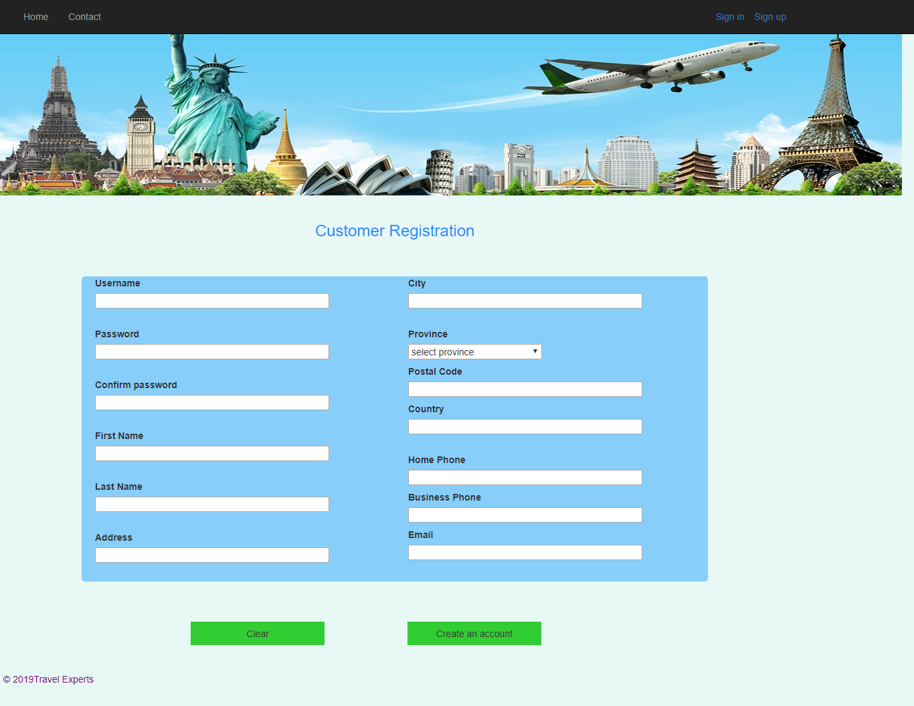
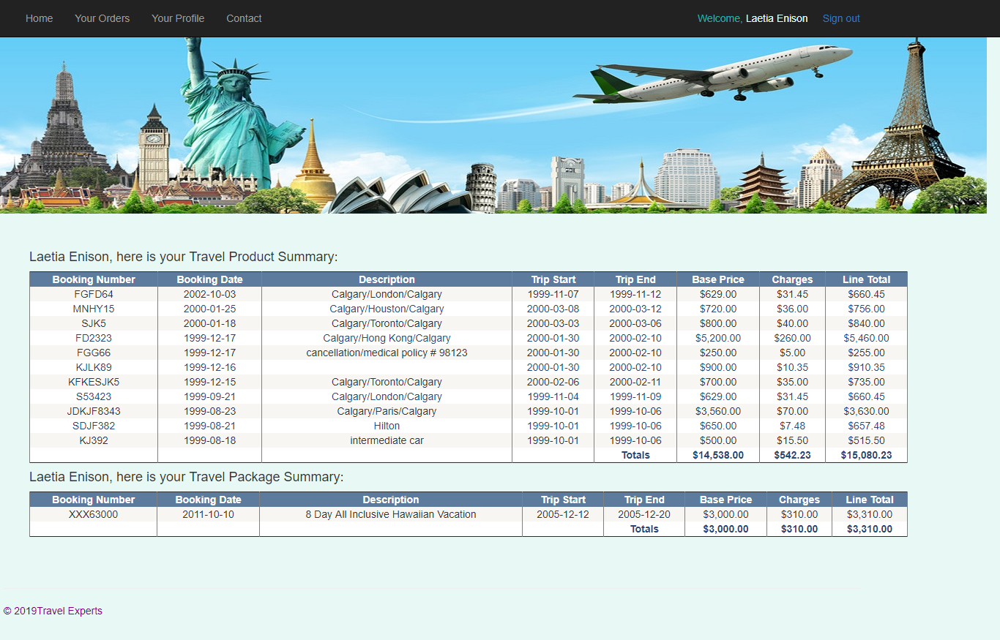

# TravelExpert-Web Application
- ASP.NET Framework
- Microsoft Visual Studio
- Microsoft SQL Server
- Bootstrap

## Team Members
- [Haley](https://github.com/hmeh)
- [Mahda](https://github.com/mahdakazemian)
- [Tim](https://github.com/tdleslie17)
- [Dao](https://github.com/daoyzheng)

## Overview
This application allows a customer to set up an account with Travel Experts by entering their name, address, city, province, email address, phone number, and fax number. 

Form data is sent to an ASP.NET page that will verify the data and either re-display the form with appropriate error messages, or create a customer record.  

The database stores the customer’s user-id and password which will enable them to log in later.

### Index 

### Customer Sign in

Customer Sign in page allows registered customer to login to the Travel Experts Web site.

### Customer Sign up

Customer Sign up page allows guest customers to register an account with Travel Experts.

### Customer Orders

Customer Orders page lists purchased products and packages of the customer. These products and packages are stored in the database and are dynamically retrieved for a logged in customer.

